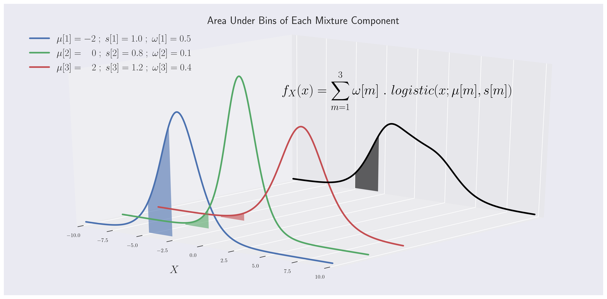

# Density Estimation in Continuous Bayesian Network with Neural Networks
This repository contains a neural-network based density estimator for a continuous Bayesian network.

This tool assumes all nodes in Bayesian network are continious and structure of Bayesian network is known.

Input:  
1) A dataframe in which each named column contains data of corresponding node.
2) A dictionary containing structure of Bayesian network

Output:  
Each trained neural network will output parameters of conditional PDF of a node X_i.

  <figure>
  
  <figcaption>Fig.1 - Neural network for learning conditional PDF of a child node.</figcaption>
  </figure>

 
 

  <figure>
  
  <figcaption>Fig.2 - Mixture-of-logistics (MoL) is used for conditional PDF of each child node.</figcaption>
  </figure>

